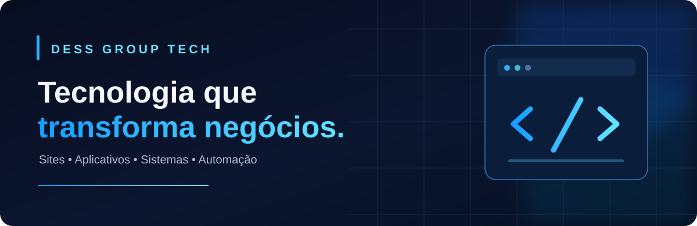
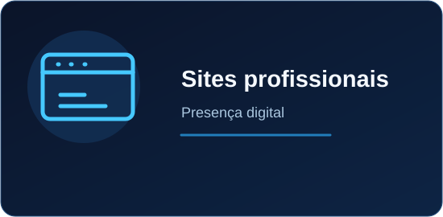
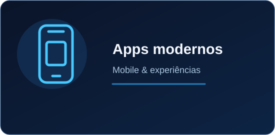
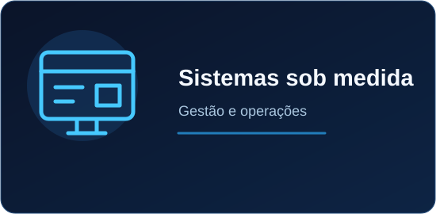
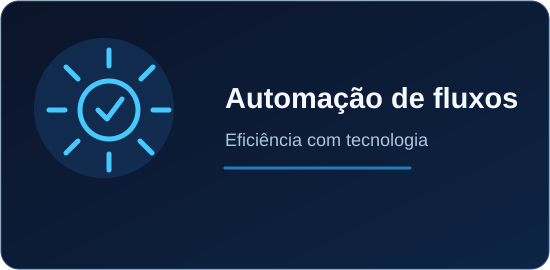
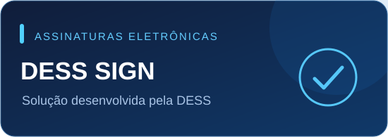
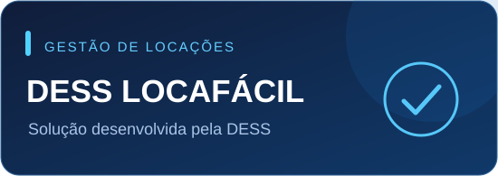

Soluções digitais pensadas para empresas que querem simplificar processos, criar experiências e crescer com tecnologia.

  
  
  
  

✦ Quem somos
A DESS Group Tech desenvolve sites, aplicativos, plataformas e sistemas personalizados para empresas. Nosso foco é transformar necessidades reais em soluções intuitivas, profissionais e preparadas para evoluir junto com cada negócio.
Unimos design, engenharia de software e automação para criar produtos digitais que facilitem a rotina e entreguem uma experiência consistente para os usuários.
✦ O que desenvolvemos

  <table>
    <tr>
      <td width="50%"></td>
      <td width="50%"></td>
    </tr>
    <tr>
      <td width="50%"></td>
      <td width="50%"></td>
    </tr>
  </table>

✦ Nossas soluções

<table>
<tr>
<td width="50%" valign="top">

 
<b>DESS Sign</b> 
Plataforma de assinatura eletrônica de documentos com envio por link, múltiplos signatários e recursos de verificação e evidências.
</td>
<td width="50%" valign="top">

 
<b>DESS LocaFácil</b> 
Sistema de gestão para locadoras e proprietários de veículos, com controle de frota, clientes, locações, contratos, vistorias e financeiro.
</td>
</tr>
</table>

✦ Tecnologias do nosso ecossistema

As tecnologias variam conforme as necessidades e a arquitetura de cada projeto.

✦ Nossa forma de trabalhar
01 · Entender	02 · Projetar	03 · Desenvolver	04 · Evoluir
Objetivos e desafios	Design e experiência	Tecnologia e integração	Testes e melhorias

Tem uma ideia para transformar em tecnologia?
Vamos conversar sobre o seu próximo projeto.

© DESS Group Tech • Tecnologia, design e inovação aplicada aos negócios.

